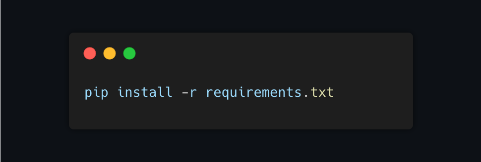
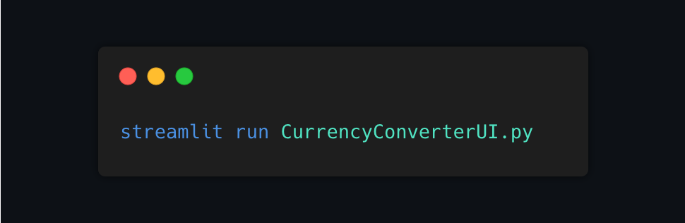

# [Remitly Currency Converter](https://zvarychdenys-remitlycurrencyconverte-currencyconverterui-4ampoh.streamlit.app/)
___
### Opis
**Remitly Currency Converter** aplikacja znajduje się na danej [stronie internetowej](https://zvarychdenys-remitlycurrencyconverte-currencyconverterui-4ampoh.streamlit.app/)
To aplikacja która wykorzystuje API Narodowego Banku Polskiego (NBP) do pobierania aktualnych kursów walutowych. Użytkownik ma możliwość wyboru dowolnej waluty z listy dostępnych walut. Została napisana w języku *Python* z wykorzystaniem bibliotek *Streamlit i  requests*.

### Struktura projektu
Projekt składa się z następujących plików:
- `CurrencyConverterUI.py` - plik główny, który zawiera kod źródłowy aplikacji
- `parserNbpAPI.py` - moduł zawierający klasy do pobierania aktualnych kursów walut oraz konwersji walut

### Wymagania
Aby uruchomić aplikację, należy mieć zainstalowaną najnowszą wersję Pythona oraz biblioteki wymienione w pliku requirements.txt. W celu zainstalowania bibliotek można użyć polecenia:

### Uruchamianie aplikacji
Aby uruchomić aplikację, należy przejść do katalogu z projektem i wpisać w terminalu następujące polecenie:

Po wykonaniu tego polecenia aplikacja powinna się uruchomić w przeglądarce internetowej. 

Lub możecie przejść pod dany link, aby zobaczyć daną aplikację: [Remitly Currency Converter](https://zvarychdenys-remitlycurrencyconverte-currencyconverterui-4ampoh.streamlit.app/)

### Autorzy
Projekt został wykonany przez Denysa Zvarycha. Proszę o kontakt w razie pytań lub sugestii dotyczących aplikacji pod adresem e-mail: denys.zvarych@gmail.com.

[Zachęcam również do obejrzenia moich innych projektów](https://github.com/zvarychdenys/Booking-project)